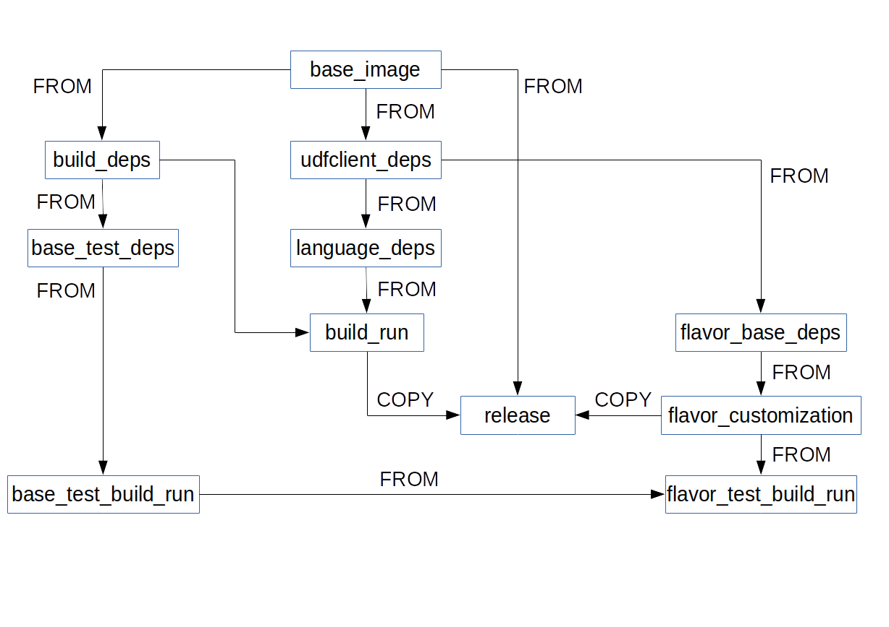

# EXASLCT (Script Langauge Container Tool)
EXASLCT is the build tool for the script language container. 
Its usage is described [here](../README.md). 
This readme is about the inner working of EXASLCT.

## About the Script Language Containers
The Script Language Containers are getting build 
from several Dockerfiles which depend on each other. 
These Dockerfiles need to install all necessary 
dependencies for the [script client](../src), 
compile the script client and install all necessary dependencies 
for the flavor and the customizations of the user.

## Problem Statement:
The old-style to build the containers was slow and laborious. 
A single change in the dependencies required a rebuild of everything. 
Furthermore, essential dependencies for the script client were 
mixed with flavor dependent dependencies. 
Changes were difficult for users and could break the container. 
It was actual unclear which of the dependencies were essential 
and which were not. For some flavors it was impossible to run 
the build on travis, because it exceeded the maximum runtime 
per job of 50 minutes. 
The build system and the test runner were bash script 
which were messy and difficult to maintain. 
They worked with background jobs to do things in parallel 
which convoluted the logs which made error analysis difficult.
Further, the test runner left temporary files which were owned by root, 
because they were created by a docker container.

## Design Goals:

* Easy customization of existing flavors for the user
* User customizations are not able to break the container
* Allowing different build steps per flavor
* Separation of concern for code and Dockerfiles
* Parallel builds
* Partial builds
* Local and remote caching
* Faster development cycles for the script client
* Allowing output redirection for testing of the flavor
* Encapsulate running the tests and all its dependencies 
  into docker containers or volumes.
* Error resilient

## Programming Model

Exaslct is a mix of a build system, test runner and infrastructure as code. 
As such, we typically have tasks like the following one:
- Build Image
- Start Container
- Upload something

Most of these tasks produce some kind of output, for example:
- docker image
- a running docker container

Often, other tasks than depend either on the output or 
the action of one or more other tasks.
These dependencies build a direct acyclic graph of tasks, 
also known as workflow.


Tasks that depend on each other need to run in sequence, 
but tasks which are independent of each other may run in parallel. 
This model also allows a good separation of concern, 
because each Task solves one Problem.


As workflow executor, we use  [Luigi](https://luigi.readthedocs.io/en/stable/) 
which was actually developed for batch data science workflows, 
but is suitable for other scenarios, too.
Luigi describes tasks as subclasses of Luigi.Task 
which implements the following methods:

```python
class TaskC(luigi.Task):

    def output(self):
        return Target()
    
    def run(self):
        #do somthing
        pass
        
    def requires(self):
        return [TaskA(),TaskB()]

```

Here we describe a TaskC which depends of TaskA and TaskB 
defined in the requires() method. 
It does something which is specified in the run() method. 
Futher, it produces Target() as output. 
Luigi provides the dependency resolution, scheduling and parallelisation.

Besides this static way of describing the dependencies between tasks, 
Luigi also provides so called 
[dynamic dependencies](https://luigi.readthedocs.io/en/stable/tasks.html#dynamic-dependencies), 
which allow more flexible patterns in special case. 
Especially, if the order of execution of dependencies is important or 
the dependencies depend on some calculation. The dynamic dependencies 
allow the implementation of a fork-join pattern.

In EXASLCT we use our own subclass of Luigi.Task, `StoppableTask` 
as base class. The StoppableTask adds profiling, 
recording of dependencies for visualization or debugging and
stops if any other StoppableTask failed in the workflow.

## Build Steps and their Dependencies

We compose the language container from several different Dockerfiles.
Each Dockerfile installs dependencies for one specific purpose.
We also added a separate Dockerfile flavor-customization for user specific changes.
The user specific changes will be merged on filesystem basis 
with the resulting docker images for the script client. 
The merge will overwrite user specific changes 
that could prevent the script client from working properly.

The following graph shows the default build steps and their dependencies.



A dependency between build steps can be either a FROM or 
COPY dependencies. A FROM dependency means that 
the target of the arrow uses the source of the arrow as base image.
A COPY dependency means that the target of the arrow 
[copies parts](https://docs.docker.com/develop/develop-images/multistage-build/) 
of the source of the arrow.

All steps with the string "build_run" in their name, 
either run the build for the script client or 
at least inherit from a images which had build it. 
As such these images contain all necessary tools to rebuild 
the script client for debugging purposes.

## How do we define build steps for a flavor

Each flavor has a build_steps.py file in the 
<flavor-path>/flavor_base directory 
which defines the build steps as classes which inherit 
from DockerFlavorAnalyzeImageTask.
For example:

```
class AnalyzeBuildRun(DockerFlavorAnalyzeImageTask):

    def get_build_step(self) -> str:
    # name of the build step, which defines the directory name 
    # for the build context of this image and gets used for the 
    # build boundaries
        return "build_run"

    def requires_tasks(self):
    # other build steps the current build step depends on, the keys used here, 
    # get replaced in your dockerfile with the actual image names of your dependencies
        return {"build_deps": AnalyzeBuildDeps(flavor_path=self.flavor_path),
                "language_deps": AnalyzeLanguageDeps(flavor_path=self.flavor_path)}

    def get_additional_build_directories_mapping(self) -> Dict[str, str]:
    # additional build directories or files which are specific to the build step
        return {"src": "src"}

    def get_path_in_flavor(self):
    # to get the path to the build context of the build step within the flavor path
        return "flavor_base"

    def get_image_changing_build_arguments(self):
    # optional: build arguments which might change the image content
        return dict()
        
    def get_transparent_build_arguments(self):
    # optional: build arguments which won't change the image content
        return dict()
```


## How does caching work

Exaslct was built with caching in mind, 
because building a flavor might take very long and 
many build steps don't change that often.
Furthermore, a end user most likely only changes the build-step 
flavor-customization which is designed to have a minimal impact 
on all other build steps.

### Which caches are available

EXASLCT provides three types of caching: 
- docker images managed by the docker daemon
- file system cache with saved docker images
- docker registry as a remote cache

All caches can work together, the analyzes phase checks 
in which cache a images is available. 
The different type of caches have different precedence 
which might you override by command line parameters. 
The precedence is derived by how fast is a image available.
Docker images managed by the docker daemon are instantaneously available.
Saved docker images on the filesystem follow next, 
they need to be loaded by the daemon, 
but are most likely on a local file system. 
The last cache which gets checked is a docker registry, 
because it is most likely not local and needs transport over network.

### Finding the corresponding docker images to the current build context

EXASLCT computes a hash value for the whole build context of an image and 
adds the hash value to the tag of the image. 
Responsible for hashing the build context is the `BuildContextHasher` 
which uses the `FileDirectoryListHasher`.

The `BuildContextHasher` combines the hash values of all directories, 
files and their executable rights of the build context, 
such as the hash values of all images
the current images depends on and the image changing build arguments 
to one hash value for the image.
 
Other build arguments which only influence the resources 
which are used to build the image are not part of the final hash.
The `BuildContextHasher` hashes the execution rights of files, 
because these are the only rights which get saved in git and 
can be important for the images.