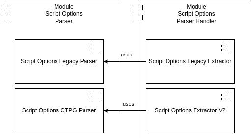
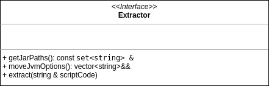
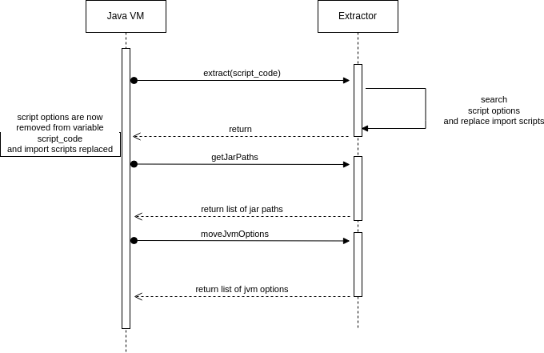
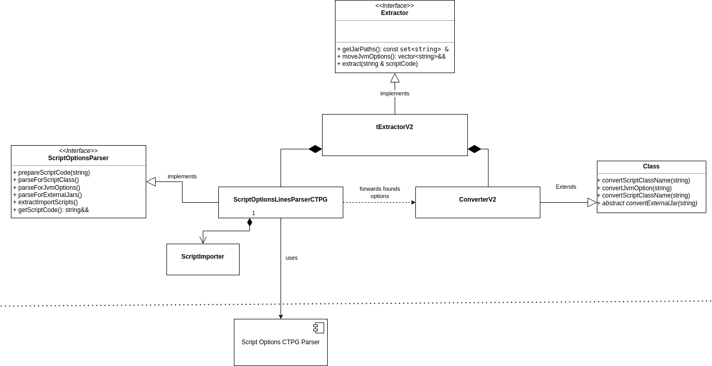
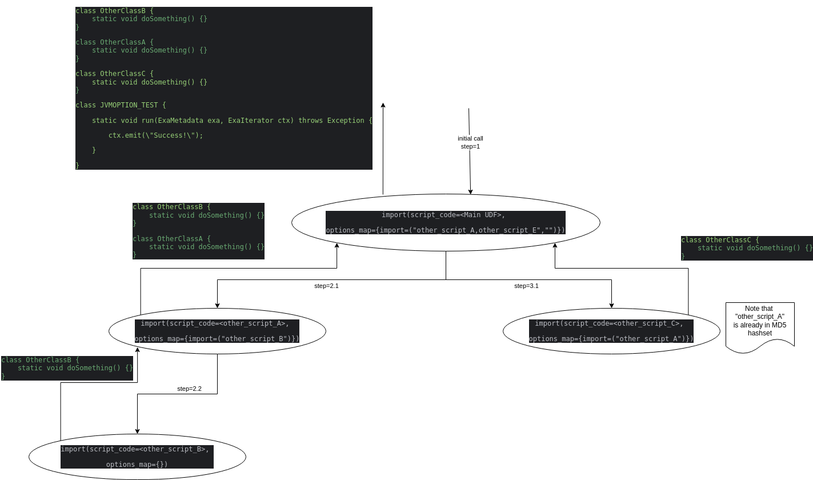

# Design Document

This document details the design aspects of the new Exasol UDF Client Script Options parser, based on the high-level requirements outlined in the System Requirement Specification.

## Acknowledgments

This document's section structure is derived from the "[arc42](https://arc42.org/)" architectural template by Dr. Gernot Starke, Dr. Peter Hruschka.

## Constraints

- The parser implementation must be in C++.
- The chosen parser implementation is [ctpg](https://github.com/peter-winter/ctpg), which supports the definition of Lexer and Parser Rules in C++ code.
- The selected parser should allow easy encapsulation in a custom C++ namespace (UDF client linker namespace constraint)
- The selected parser should not depend on additional runtime dependencies
- The selected parser should have minimal compile time dependencies, i.e. no additional shared libraries or tools to generate C++ code

### Requirement Overview

Please refer to the [System Requirement Specification](script_options_requirments.md) for user-level requirements.

## Building Blocks

### Overall Architecture

#### Component Overview



At the very high level there can be distinguished between the generic "Script Options Parser" module which parses a UDF script code and returns the found script options, and the "Script Options Parser Handler" which converts the Java UDF specific script options. In both modules there are specific implementation for the legacy parser and the new CTPG based parser.

### Script Options Parser

The parser component can be used to parse any script code (Java, Python, R) for any script options. It provides simplistic interfaces, which are different between the two versions, which accept the script code as input and return the found script option(s). 

#### Legacy Parser

The legacy parser (V1) parser searches for one specific script option. The parser starts from beginning of the script code. If found, the parser immediately removes the script option from the script code and returns the option value. It validates the 

#### V2 Parser

The new parser uses the [CTPG libary](https://github.com/peter-winter/ctpg) which fulfills the technical constraints: It comes as a single C++ header file and does not require any runtime dependencies. The grammar and lexical rules can be defined in pure C++ and the parser is constructed during compile time, thus not having any performance overhead at runtime. 
It is important to use a parser generator implementation which allows the definition of grammar and lexical rules, in order to achieve the new requirements regarding recognizing escape sequences in the script option values. Also, the clear definition of those rules makes the implementation better understandable. 

As the parser needs to find script options in any given script code, the generated parser must accept any strings which are not script options and ignore those. In order to achieve this, the lexer rules need to be as simple as possible, in order to avoid collisions.

It is important to emphasize that in contrast to the legacy parser, the caller is responsible for removing the script options from the script code.
The interface provides a method which accepts the script code as input and returns a map with all found script options in the whole code. Each key in the map points to a list of all option values plus the start and end position of the option for this specific option key.

### Parser Handler

The parser handler uses the Script Options parser to query for specific options which are part of [Exasol's Java UDF specification](https://docs.exasol.com/db/latest/database_concepts/udf_scripts/java.htm):
1. JVM Options
2. JAR Options
3. Import Script Options
4. ScriptClass Option

Because the new parser implementation parses all script options at once, and because some of the system requirements differ between both version, the Parser Handler implementations are also very different between the legacy and the ctpg based one. However, both implementations provide the same interface to the Java VM in the UDF Framework:



Note that variable `script_code` is passed per reference. This is because the Parser Handler might modify the script code:
1. Remove the script options
2. Replace any found `import` script option with the respective scripts.

The following sequence diagram shows how the Java VM implementation uses the Parser Handler to extract the script options.



#### Legacy Parser Handler


The `ScriptOptionsLinesParserLegacy` class uses the Parser to search for Java specific script options and forwards the found options to class `ConverterLegacy`, which uses a common implementation for the conversion of the options.
Class `tLegacyExtractor` connects `ScriptOptionsLinesParserLegacy` to `ConverterLegacy` and then orchestrates the parsing sequence. 

`ScriptOptionsLinesParserLegacy` also implements the import of foreign scripts. The import script algorithm iteratively replaces foreign scripts. The algorithm is described in the following pseudocode snippet:
```
while True:
 next_import_option, position = ScriptOptionsLegacyParser.parse(script_code, "%import")
 if next_import_option_value != "":
   foreign_script_code = resolve_foreign_script_somehow(next_import_option.value)
   if not md5_hashset.has(foreign_script_code):
      md5_hashset.add(foreign_script_code)
      script_code.replaceAt(position, lenght(next_import_option), foreign_script_code) 
 else if not found:
   break
```

#### CTPG based Parser Handler



The `ScriptOptionsLinesParserCTPG` class uses the new CTPG basedParser to search for **all** Java specific script options at once. Then it forwards the found options to class `ConverterV2`, which uses a common implementation for the conversion of the options. `ConverterV2` also implements the functions to convert Jvm otions and JAR options.   
Class `tExtractorV2` connects `ScriptOptionsLinesParserCTPG` to `ConverterV2` and then orchestrates the parsing sequence.

##### CTPG based Script Import Algorithm
`ScriptOptionsLinesParserCTPG` uses an instance of `ScriptImporter` to import foreign scripts. Because the new parser collects all script options at once, but backwards compatibility with existing UDF scripts must be ensured, there is an additional level of complexity in the import script algorithm. The algorithm is described in the following pseudocode snippet:
```
function import(script_code, options_map)
 import_option = options_map.find("import")
 if found:
    sorted_import_option = sort(import_option) //import options according to their location in the script, increasing order
    collectedScripts = list() //list of (script_code, location, size)
    for each import_option in sorted_import_option:
       import_script_code = resolve_foreign_script_somehow(import_option.value)
       if not md5_hashset.has(import_script_code):
          md5_hashset.add(import_script_code)
          new_options_map = ScriptOptionsCTPGParser.parse(import_script_code)
          new_script_code = ""
          import(new_script_code, new_options_map)
          collectedScripts.add(new_script_code, import_option.position, import_option.length_of_script_option) 
    for foreign_script in reverse(collectedScripts):
       script_code.replaceAt(foreign_script.position, foreign_script.length_of_script_option, foreign_script.foreign_script) 
```

The scripts need to be replaced in reverse order because otherwise the locations of import options later in the script would get invalidated by the replacement.

The following example demonstrates the flow of the algorithm:

_Main UDF_:
```
%import other_script_A;
%import other_script_C;
class JVMOPTION_TEST {
    static void run(ExaMetadata exa, ExaIterator ctx) throws Exception {
        ctx.emit(\"Success!\");
    }
}
```

_other_script_A_:
```
%import other_script_B;
class OtherClassA {
    static void doSomething() {}
}
```

_other_script_B_:
```
class OtherClassB {
    static void doSomething() {}
}
```

_other_script_C_:
```
%import other_script_A
class OtherClassC {
    static void doSomething() {}
}
```

The following diagram shows how the scripts are collected in the recursive algorithm:




## Runtime

## Cross-cutting Concerns

## Design Decisions for V2

### Parser Implementation
`dsn~parser-implementation~1`

Implement the parser using [ctpg](https://github.com/peter-winter/ctpg), an open-source parser library. This library will be used to define Lexer and Parser Rules in C++ code, ensuring no additional runtime dependencies exist.


Covers:
- `req~general-script-options-parsing~1`
- `req~existing-parser-library-license~1`

Tags: V2


### Lexer and Parser Rules Option
`dsn~lexer-parser-rules~1`

Lexer and Parser rules to recognize `%optionKey`, `optionValue`, with whitespace characters as separator. The Parser rules will define the grammar to correctly identify Script Options, manage multiple options with the same key, and handle duplicates.


Covers:
- `req~general-script-options-parsing~1`
- `req~white-spaces~1`
- `req~leading-white-spaces-script-options-parsing~1`

Depends:
- `dsn~parser-implementation~1`

Tags: V2

### Lexer and Parser Rules Not an option
`dsn~lexer-parser-rules-not-an-option~1`

Lexer and Parser rules to recognize anything what is not an option.


Covers:
- `req~ignore-none-script-options~1`

Depends:
- `dsn~parser-implementation~1`

Tags: V2

### Run Parser line-by-line
`dsn~run-parser-line-by-line~1`

The parser must be executed line-by-line, because script options can be placed at any location in the UDF. Every found map of options must be added to the resulting map.


Covers:
- `req~multiple-lines-script-options-parsing~1`

Depends:
- `dsn~parser-implementation~1`

Tags: V2

### Ignore lines without script options
`dsn~ignore-lines-without-script-options~1`

In order to avoid lower performance compared to the old implementation, the parser must run only on lines which contain a `%` character.


Covers:
- `req~multiple-lines-script-options-parsing~1`

Depends:
- `dsn~parser-implementation~1`

Tags: V2


### Handling Multiple and Duplicate Options
`dsn~handling-multiple-duplicate-options~1`

Create a mechanism within the parser to collect and aggregate multiple Script Options with the same key.
The parser must return an associative container of the format:
```
{
<option key A> => list(<option_value A.1>, <option_value A.2>,..., <option_value A.n>),
<option key B> => list(<option_value B.1>, <option_value B.2>,..., <option_value B.m>)
}
```   


Covers:
- `req~multiple-options-management~1`
- `req~duplicate-options-management~1`

Tags: V2

### Lexer and Parser Rules Whitespace Sequences
`dsn~lexer-parser-rules-whitespace-sequences~1`

Define the Lexer rules to tokenize whitespace sequences, and parser rules to recognize those white space characters as option separator.
For white space character within an option value, those must be added as is to the result option value.
For white space character in anything else, what is not an option, those white space characters must be ignored.


Covers:
- `req~white-spaces-script-options-parsing-v2~1`
Depends:
- `dsn~parser-implementation~1`

Tags: V2

### Lexer and Parser Rules Whitespace Escape Sequences
`dsn~lexer-parser-rules-whitespace-escape-sequences~1`

Define the Lexer rules to tokenize whitespace escape sequences:
- '\ ' => space character
- '\t' => <tab> character
- '\f' => <form feed> character
- '\v' => <vertical tab> character

Implement rules which replace those white space escape tokens only at the beginning of an option value. Add parser rules to ignore those tokens in anything else, which is not a script option. Those token are not expected to be part of an option key.


Covers:
- `req~leading-white-spaces-script-options-parsing~1`
Depends:
- `dsn~parser-implementation~1`

Tags: V2

### Lexer and Parser Rules Escape Sequences
`dsn~lexer-parser-rules-escape-sequences~1`

Define the Lexer rules to tokenize '\n', '\r', '\; sequences, and parser rules to replace those sequences with <line feed>, <carriage return> or ';' characters. 
Implement rules which replace those token at any location in an option value. Add parser rules to ignore those tokens in anything else, which is not a script option. Those token are not expected to be part of an option key.


Covers:
- `req~escape-sequence-script-options-parsing~1`
Depends:
- `dsn~parser-implementation~1`

Tags: V2

### Script Option Removal Mechanism
`dsn~script-option-removal~1`

Implement a method in class `ScriptOptionLinesParserCTPG` which removes *all* identified Script Options from the original script code at once. This method be executed after the import scripts are replaced. The algorithm must replace the script options in reverse order in order to maintain consistency of internal list of positions.


Covers:
- `req~script-option-removal~1`
- `req~java-scriptclass-option-handling-v2~1`

Tags: V2

### Unknown Options Check
`req~script-option-unknown-options-behvaior-v2~1`

Implement a check which verifies that only known script options are found. Otherwise, raise an exception with information about the position and name of the unknown option.


Covers:
- `req~script-option-removal~1`

Tags: V2

### Java %scriptclass Option Handling in Design
`dsn~java-scriptclass-option-handling~1`

Implement a function in the `Converter` class which adds the script class option to the JVM Options list.


Covers:
- `req~java-scriptclass-option-handling~1`

Tags: V2

### Java %jar Option Collection
`dsn~java-jar-option-collection~1`

Implement an algorithm in class `ConverterV2` to split the given Jar option value by colon (':') and then collect the found Jar options in a list. 


Covers:
- `req~java-jar-option-handling-v2~1`
- `req~java-jar-option-handling-multiple-options~1`

Tags: V2

### Java %jar Option Whitespace Handling
`dsn~java-jar-option-whitespace-handling~1`

Implement an algorithm in class `ScriptOptionLinesParserCTPG` which replaces trailing white space escape sequences in a Jar option value with the respective white space character. 


Covers:
- `req~java-jar-option-trailing-white-space-handling~1`

Tags: V2


### Java %jvmoption Handling
`dsn~java-jvmoption-handling~1`

Implement an algorithm in class `ConverterV2` which uses the `CTPG` library to parse and split a Jvm option value by white space characters.


Covers:
- `req~java-jvmoption-handling~1`
- `req~java-jvmoption-whitespace-handling~1`

Tags: V2

### Java %jvmoption Whitespace Escape Handling
`dsn~java-jvmoption-whitespace-esacape-handling~1`

Define the Lexer rules to tokenize whitespace escape sequences:
- '\ ' => space character
- '\t' => <tab> character
- '\f' => <form feed> character
- '\v' => <vertical tab> character

Implement rules which replace those white space escape tokens which are part of a Jvm option.


Depends:
- `req~java-jvmoption-handling~1`

Covers:
- `req~java-jvmoption-whitespace-handling~1`

Tags: V2

### Java %import Option Replacement
`dsn~java-import-option-replacement~1`

Implement logic to process %import options by interacting with the Swig Metadata object.
The algorithm should work according to  [section CTPG based Script Import Algorithm](#CTPG-based-Script-Import-Algorithm). 


Covers:
- `req~java-import-option-replace-referenced-scripts~1`
- `feat~java-specific-script-options~1`
- `feat~java-specific-script-options~1`

Tags: V2

### Java %import Option resolve foreign Script Options
`dsn~java-import-option-resolve-foreign-script-options~1`

After all `%import` script options are replaced in the script code, the parser must re-run in order to also detect script options which are part of the imported scripts. 


Covers:
- `req~java-import-option-handling-v2~1`


Tags: V2

### General Parser Integration
`dsn~general-parser-integration~1`

Ensure that the new parser integrates seamlessly into the Exasol UDF Client environment. This includes embedding the parser within the custom C++ namespace, ensuring it meets all linker requirements, and does not introduce additional runtime dependencies.


Covers:
- `req~general-script-options-parsing~1`

Tags: V2

## Quality Scenarios

## Risks

### Overall

#### Efficient Parser implementation

The performance must not be slower than the old implementation.

##### Mitigation

`dsn~ignore-lines-without-script-options~1` tries to mitigate this risk.
