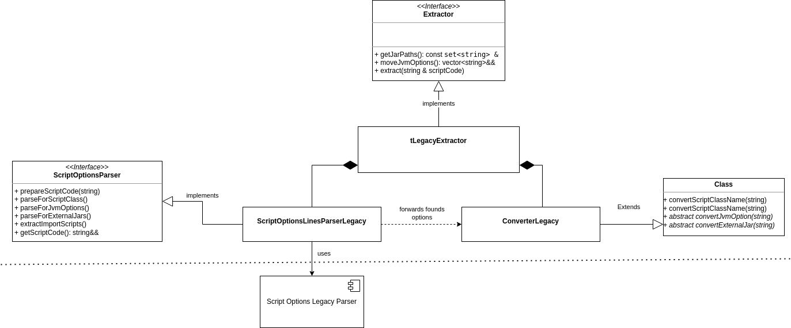

# Design Document

This document details the design aspects of the new Exasol UDF Client Script Options parser, based on the high-level requirements outlined in the System Requirement Specification.

## Acknowledgments

This document's section structure is derived from the "[arc42](https://arc42.org/)" architectural template by Dr. Gernot Starke, Dr. Peter Hruschka.

## Constraints

- The parser implementation must be in C++.
- The chosen parser implementation is [ctpg](https://github.com/peter-winter/ctpg), which supports the definition of Lexer and Parser Rules in C++ code.
- The selected parser should allow easy encapsulation in a custom C++ namespace (UDF client linker namespace constraint)
- The selected parser should not depend on additional runtime dependencies
- The selected parser should have minimal compile time dependencies, i.e. no additional shared libraries or tools to generate C++ code

### Requirement Overview

Please refer to the [System Requirement Specification](script_options_requirments.md) for user-level requirements.

## Building Blocks

### Overall Architecture

#### Component Overview


At the very high level there can be distinguished between the generic "Script Options Parser" module which parses a UDF script code and returns the found script options, and the "Script Options Parser Handler" which converts the Java UDF specific script options. In both modules there are specific implementation for the legacy parser and the new CTPG based parser.

### Script Options Parser

The parser component can be used to parse any script code (Java, Python, R) for any script options. It provides simplistic interfaces, which are different between the two versions, which accept the script code as input and return the found script option(s). 

#### Legacy Parser

The legacy parser (V1) parser searches for one specific script option. The parser starts from beginning of the script code. If found, the parser immediately removes the script option from the script code and returns the option value. It validates the 

#### V2 Parser

The new parser uses the [CTPG libary](https://github.com/peter-winter/ctpg) which fulfills the technical constraints: It comes as a single C++ header file and does not require any runtime dependencies. The grammar and lexical rules can be defined in pure C++ and the parser is constructed during compile time, thus not having any performance overhead at runtime. 
It is important to use a parser generator implementation which allows the definition of grammar and lexical rules, in order to achieve the new requirements regarding recognizing escape sequences in the script option values. Also, the clear definition of those rules makes the implementation better understandable. 

As the parser needs to find script options in any given script code, the generated parser must accept any strings which are not script options and ignore those. In order to achieve this, the lexer rules need to be as simple as possible, in order to avoid collisions.

It is important to emphasize that in contrast to the legacy parser, the caller is responsible for removing the script options from the script code.
The interface provides a method which accepts the script code as input and returns a map with all found script options in the whole code. Each key in the map points to a list of all option values plus the start and end position of the option for this specific option key.

### Parser Handler

The parser handler uses the Script Options parser to query for specific options which are part of [Exasol's Java UDF specification](https://docs.exasol.com/db/latest/database_concepts/udf_scripts/java.htm):
1. JVM Options
2. JAR Options
3. Import Script Options
4. ScriptClass Option

Because the new parser implementation parses all script options at once, and because some of the system requirements differ between both version, the Parser Handler implementations are also very different between the legacy and the ctpg based one. However, both implementations provide the same interface to the Java VM in the UDF Framework:


Note that variable `script_code` is passed per reference. This is because the Parser Handler might modify the script code:
1. Remove the script options
2. Replace any found `import` script option with the respective scripts.

The following sequence diagram shows how the Java VM implementation uses the Parser Handler to extract the script options.


#### Legacy Parser Handler



The `ScriptOptionsLinesParserLegacy` class uses the Parser to search for Java specific script options and forwards the found options to class `ConverterLegacy`, which uses a common implementation for the conversion of the options.
Class `tLegacyExtractor` connects `ScriptOptionsLinesParserLegacy` to `ConverterLegacy` and then orchestrates the parsing sequence. 

`ScriptOptionsLinesParserLegacy` also implements the import of foreign scripts. The import script algorithm iteratively replaces foreign scripts. The algorithm is described in the following pseudocode snippet:
```
while True:
 call Script Option Parser to search for next import script option starting from beginning of script code
 if found:
   if checksum of foreign script is not in the md5 hashset:
      insert the script code into the md5 hashset
      insert the foreign script on the same position as the import script option was found
 else if not found:
   break
```

#### CTPG based Parser Handler


The `ScriptOptionsLinesParserCTPG` class uses the new CTPG basedParser to search for **all** Java specific script options at once. Then it forwards the found options to class `ConverterV2`, which uses a common implementation for the conversion of the options.
Class `tLegacyExtractor` connects `ScriptOptionsLinesParserLegacy` to `ConverterLegacy` and then orchestrates the parsing sequence. 

## Runtime

## Cross-cutting Concerns

## Design Decisions

### Parser Implementation
`dsn~parser-implementation~1`

Implement the parser using [ctpg](https://github.com/peter-winter/ctpg), an open-source parser library. This library will be used to define Lexer and Parser Rules in C++ code, ensuring no additional runtime dependencies exist.

Needs: req
Covers:
- `req~new-parser-implementation~1`

### Lexer and Parser Rules
`dsn~lexer-parser-rules~1`

Define the Lexer rules to tokenize `%optionKey`, `optionValue`, and allowed whitespace characters, including `\t`, `\v`, and `\f`. The Parser rules will define the grammar to correctly identify Script Options, manage multiple options with the same key, and handle duplicates.

Needs: req
Covers:
- `req~general-script-options-parsing~1`

### Handling Multiple and Duplicate Options
`dsn~handling-multiple-duplicate-options~1`

Create a mechanism within the parser to collect and aggregate multiple Script Options with the same key. Use a data structure (e.g., a map of lists) to store options by key and ensure duplicates are handled according to specified rules for different options.

Needs: req
Covers:
- `req~multiple-duplicate-options-management~1`

### Script Option Removal Mechanism
`dsn~script-option-removal-mechanism~1`

Implement a method to remove identified Script Options from the original script code. This method will traverse the code, identify Script Options using defined tokens, and replace them with whitespace to ensure the cleaned script executes smoothly.

Needs: req
Covers:
- `req~script-option-removal~1`

### Java %scriptclass Option Handling in Design
`dsn~java-scriptclass-option-handling~1`

Design logic to correctly identify a single %scriptclass option within the script. Additional occurrences of %scriptclass will be removed from the script code. Use a flag to mark the first occurrence and ensure subsequent ones are discarded.

Needs: req
Covers:
- `req~java-scriptclass-option-handling~1`

### Java %jar Option Handling in Design
`dsn~java-jar-option-handling~1`

Design the parser to collect and handle multiple %jar options. Ensure that they follow the Java CLASSPATH environment variable syntax (colon-separated values), remove duplicates, and maintain the order specified in the script by using sets and lists.

Needs: req
Covers:
- `req~java-jar-option-handling~1`

### Java %jvmoption Handling in Design
`dsn~java-jvmoption-handling~1`

Create a way for the parser to collect multiple %jvmoption options, allowing duplicates and preserving the order specified. This can be achieved using a list to store the options as they are parsed.

Needs: req
Covers:
- `req~java-jvmoption-handling~1`

### Java %import Option Handling in Design
`dsn~java-import-option-handling~1`

Implement logic to process %import options by interacting with the Swig Metadata object. The parser will replace the found %import Script Option with the referenced script code and handle nested %jar, %jvmoption, and %import options, ignoring %scriptclass options in imported scripts.

Needs: req
Covers:
- `req~java-import-option-handling~1`

### General Parser Integration
`dsn~general-parser-integration~1`

Ensure that the new parser integrates seamlessly into the Exasol UDF Client environment. This includes embedding the parser within the custom C++ namespace, ensuring it meets all linker requirements, and does not introduce additional runtime dependencies.

Needs: req
Covers:
- `req~new-parser-integration~1`

## Quality Scenarios

## Risks

### Overall

#### Efficient Handling of Large Data Volumes

DLHC must efficiently handle large data volumes within acceptable time frames.

##### Mitigation

The most critical part is importing many large Parquet files into the Exasol database. We implement loading of Parquet files in ExaLoader directly in the database:
* This reduces the number of components involved in the import to a minimum: ExaLoader reads Parquet files directly from the source and inserts directly into the database. No other external system is involved other than the storage system (S3).
* ExaLoader can import multiple data files in parallel.

#### Inefficient Handling of Delta Table Reorg

Data reorganization of a Delta table (compaction of existing files etc.) requires DLHC to delete and re-import large amounts.

##### Mitigation

* We accept the risk and assume that reorganization is usually not done or only on a limited number of data files.
* Operator guide explains that data reorganization will basically require a complete re-import of the complete data.

#### Delta Table Column Mapping

[Column Mapping](https://github.com/delta-io/delta/blob/master/PROTOCOL.md#column-mapping) (feature `columnMapping`) allows renaming columns without rewriting data files. Parquet files will contain **physical column names** like `col-a7f4159c-53be-4cb0-b81a-f7e5240cfc49`. The mapping from physical column names to user visible logical column names is stored in the Delta log.

Physical column names are consistent over time across multiple files.

See also [Databricks Documentation](https://docs.databricks.com/en/delta/column-mapping.html).

##### Mitigation

* DLHC must specify **physical column names** in `IMPORT` statements


## Delimitations

### Time-Travel Queries

DLHC does not support time-travel queries on the imported data.

### Parallel Import of Parquet Row Groups

It would be possible for ExaLoader to import a single large Parquet file in parallel by splitting it into its row groups. We assume that data files are usually not larger than 130MB. This means that parallelizing the import on row-group level is not required because parallelizing on file level is enough.

See [Row Group Parallelization](#row-group-parallelization).